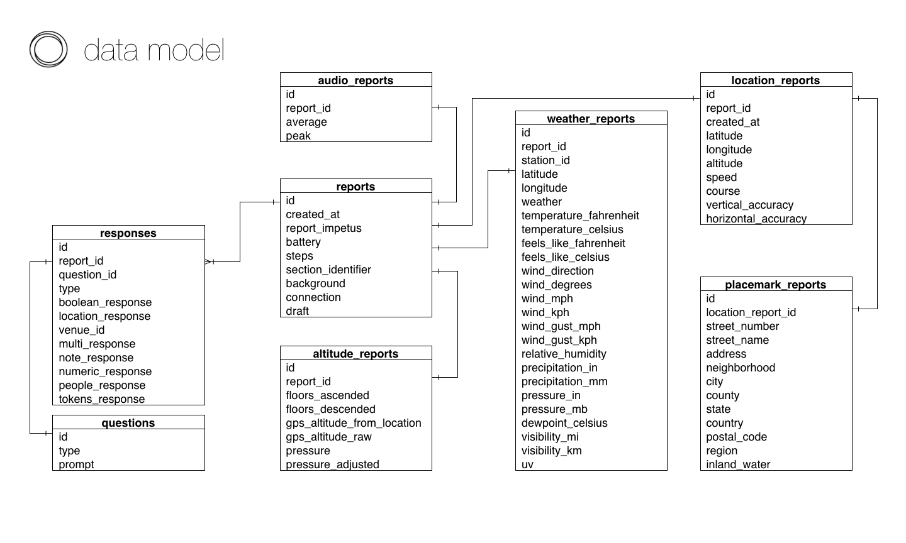

Datums is a PostgreSQL pipeline for [Reporter](http://www.reporter-app.com/). Datums will insert records from the Dropbox folder that contains your exported Reporter data<sup>[1](#notes)</sup> into PostgreSQL.

> ["Self-tracking is only useful if it leads to new self-knowledge and—ultimately—new action."](https://medium.com/buster-benson/how-i-track-my-life-7da6f22b8e2c)

# Getting Started

## Create the Database

To create the datums database, first ensure that you have postgres installed and that the server is running locally. To create the database
```
$ createdb datums --owner=username
```
where `username` is the output of `whoami`. You're obviously free to name the database whatever you want, just make sure that when you declare the database URI below that it points to the right database.

## Installation

To install datums, first clone this repository
```
$ git clone https://github.com/thejunglejane/datums.git
$ cd datums
```
Rename the .env-example file to .env and fill in the database URI information.

```
export DATABASE_URI=postgresql://<your postgres user here>@localhost:5432/datums
```

If you're not using a tool like [autoenv](https://github.com/kennethreitz/autoenv), you'll need to source the .env after filling in your information. Finally, run the setup script

```
$ source .env
$ python setup.py install
```
You should now have both the `datums` executable and Python library installed.

### Setup the Database

Before adding any reports, you'll need to setup the database schema. The database schema is defined in the `models` module. Here's a picture



You can setup the database from the command line or from Python. From the command line, execute `datums` with the `--setup` flag.
```
$ datums --setup
```
or, from Python
```python
>>> from datums.models import base
>>> base.database_setup(base.engine)
```

You can also teardown the database, if you ever need to. This will remove all the tables from the database, but won't delete the database. To teardown the database from the command line, include the `--teardown` flag
```
$ datums --teardown
```
or, from Python
```python
>>> from datums.models import base
>>> base.database_teardown(base.engine)
```

# Adding, Updating, and Deleting
The `pipeline` module allows you to add, update, and delete reports and questions.

### Definitions
We should define a few terms before getting into how to use the pipeline.

* A **reporter file** is a JSON file that contains all the **report**s and all the **question**s for a given day. These files should be located in your Dropbox/Apps/Reporter-App folder. 
* A **report** comprises a **snapshot** and all the **response**s collected by Reporter when you make a report.
* A **snapshot** contains the information that the Reporter app automatically collects when you make a report, things like the weather, background noise, etc.
* A **response** is the answer you enter for a question.

Every **report** will have one **snapshot** and some number **response**s associated with it, and every **reporter file** will have some number **report**s and some number of **question**s associated with it, depending on how many times you make reports throughout the day. 

If you add or delete questions from the Reporter app, different **reporter file**s will have different **question**s from day to day. When you add a new **reporter file**, first add the **question**s from that day. If there are no new **question**s, nothing will happen; if there is a new **question**, datums will add it to the database.

## Adding questions and reports

When you first set datums up, you'll probably want to add all the questions and reports in your Dropbox Reporter folder.

#### Command Line
To add all the reporter files in your Dropbox Reporter folder from the command line, execute `datums` with the `--add` flag followed by the path to your Dropbox Reporter folder

```
$ datums --add /path/to/reporter/folder/*.json
```
Make sure you include the '*.json' at the end to exclude the extra files in that folder. 

To add the questions and reports from a single reporter file, include the filepath after the `--add` flag instead of the directory's path
```
$ datums --add /path/to/file
```

#### Python
You can add all the reporter files or a single reporter file from Python as well.

```python
>>> from datums.pipeline import add
>>> import glob
>>> import json
>>> all_reporter_files = glob.glob('/path/to/reporter/folder/', '*.json'))
>>> for file in all_reporter_files:
...    with open(os.path.expanduser(file), 'r') as f:
...        day = json.load(f)
...    # Add questions first because reports need them
...    for question in day['questions']:
...        add.add_question(question)
...    for report in day['snapshots']:
...        add.add_report(report)
```
```python
>>> from datums.pipeline import add
>>> import json
>>> with open('/path/to/file', 'r') as f:
...    day = json.load(f)
>>> # Add questions first because reports need them
>>> for question in day['questions']:
...     add.add_question(question)
>>> for report in day['snapshots']:
...    add.add_report(report)
```

You can also add a single report from a reporter file, if you need/want to
```python
>>> from datums.pipeline import add
>>> import json
>>> with open('/path/to/file', 'r') as f:
...    day = json.load(f)
>>> report = day['snapshots'][n]  # where n is the index of the report
>>> add.add_report(report)
```

## Updating reports

If you make a change to one of your Reporter files, or if Reporter makes a change to one of those files, you can also update your reports. If a new report has been added the file located at '/path/to/file', the update will create it in the database.

#### Command Line

To update all reports in all the files in your Dropbox Reporter folder

```
$ datums --update /path/to/reporter/folder/*.json
```
and to update all the reports in a single reporter file
```
$ datums --update /path/to/file
```

#### Python
From Python
```python
>>> from datums.pipeline import update
>>> import glob
>>> import json
>>> all_reporter_files = glob.glob('/path/to/reporter/folder/', '*.json'))
>>> for file in all_reporter_files:
...    with open(os.path.expanduser(file), 'r') as f:
...        day = json.load(f)
...    for report in day['snapshots']:
...        update.update_report(report)
```
```python
>>> from datums.pipeline import update
>>> import json
>>> with open('/path/to/file', 'r') as f:
...    day = json.load(f)
>>> for report in day['snapshots']:
...    update.update_report(report)
```

To update an individual report within a reporter file with
```python
>>> from datums.pipeline import update
>>> import json
>>> with open('/path/to/file', 'r') as f:
...    day = json.load(f)
>>> report = day['snapshots'][n]  # where n is the index of the report
>>> update.update_report(report)
```
#### Changing a Report
> While it is possible to change your response to a question from Python, it's not recommended. Datums won't overwrite the contents of your files, and you will lose the changes that you make the next time you update the reports in that file. If you make changes to a file itself, you may run into conflicts if Reporter tries to update that file.

> If you do need to change your response to a question, I recommend that you do so from the Reporter app. The list icon in the top left corner will display all of your reports, and you can select a report and make changes. If you have 'Save to Dropbox' enabled, the Dropbox file containing that report will be updated when you save your changes; if you don't have 'Save to Dropbox' enabled, the file containing the report will be updated the next time you export. Once the file is updated, you can follow the steps above to update the reports in that file in the database.

## Deleting reports

Deleting reports from the database is much the same. 

#### Command Line
You can delete all reports in your Dropbox Reporter folder with
```
$ datums --delete /path/to/reporter/folder/*.json
```
and the reports in a single file with
```
$ datums --delete /path/to/file
```

#### Python
```python
>>> from datums.pipeline import delete
>>> import glob
>>> import json
>>> all_reporter_files = glob.glob('/path/to/reporter/folder/', '*.json'))
>>> for file in all_reporter_files:
...    with open(os.path.expanduser(file), 'r') as f:
...        day = json.load(f)
...    for report in day['snapshots']:
...        delete.delete_report(report)
```
```python
>>> from datums.pipeline import delete
>>> import json
>>> with open('/path/to/file', 'r') as f:
...    day = json.load(f)
>>> for report in day['snapshots']:
...    delete.delete_report(report)
```

To delete a single report within a reporter file
```python
>>> from datums.pipeline import delete
>>> import json
>>> with open('/path/to/file', 'r') as f:
...    day = json.load(f)
>>> report = day['snapshots'][n]  # where n is the index of the report
>>> delete.delete_report(report)
```

## Deleting questions

You can also delete questions from the database. Note that this will delete any responses associated with the deleted question as well.

```python
>>> from datums.pipeline import delete
>>> import json
>>> with open('/path/to/file', 'r') as f:
...    day = json.load(f)
>>> question = day['questions'][n]  # where n is the index of the question
>>> delete.delete_question(question)
```

# Notes

1. This version of datums only supports JSON exports.

# Licensing

Copyright (c) 2015 Jane Stewart Adams

Permission is hereby granted, free of charge, to any person obtaining a copy
of this software and associated documentation files (the "Software"), to deal
in the Software without restriction, including without limitation the rights
to use, copy, modify, merge, publish, distribute, sublicense, and/or sell
copies of the Software, and to permit persons to whom the Software is
furnished to do so, subject to the following conditions:

The above copyright notice and this permission notice shall be included in
all copies or substantial portions of the Software.

THE SOFTWARE IS PROVIDED "AS IS", WITHOUT WARRANTY OF ANY KIND, EXPRESS OR
IMPLIED, INCLUDING BUT NOT LIMITED TO THE WARRANTIES OF MERCHANTABILITY,
FITNESS FOR A PARTICULAR PURPOSE AND NONINFRINGEMENT. IN NO EVENT SHALL THE
AUTHORS OR COPYRIGHT HOLDERS BE LIABLE FOR ANY CLAIM, DAMAGES OR OTHER
LIABILITY, WHETHER IN AN ACTION OF CONTRACT, TORT OR OTHERWISE, ARISING FROM,
OUT OF OR IN CONNECTION WITH THE SOFTWARE OR THE USE OR OTHER DEALINGS IN
THE SOFTWARE.
